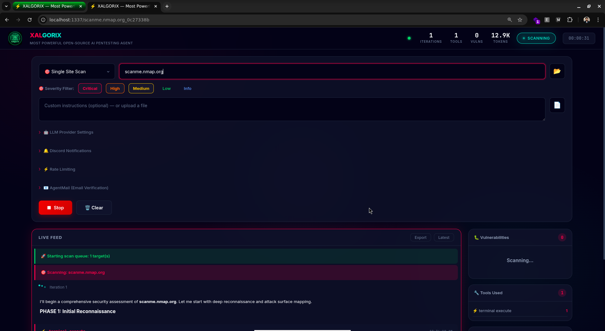
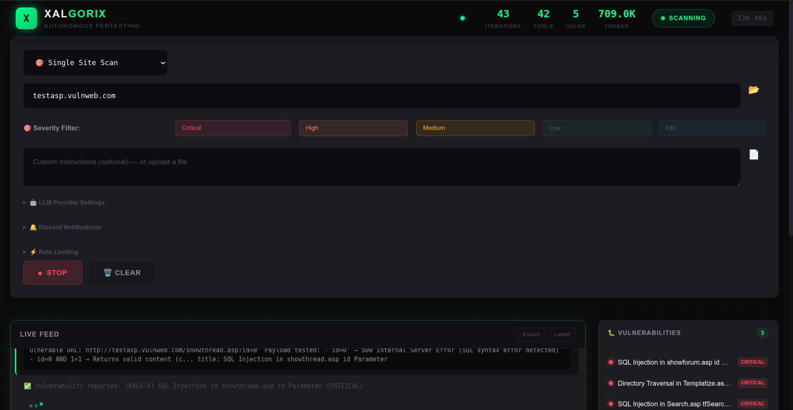
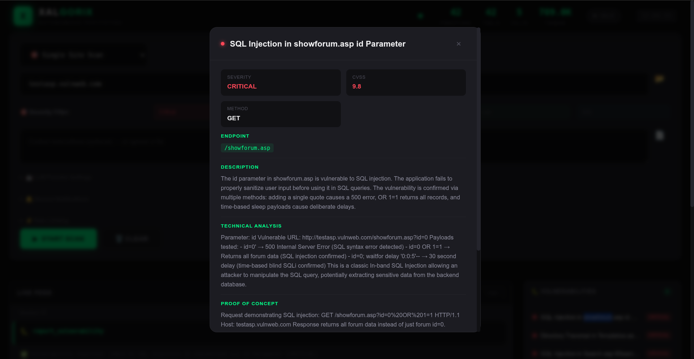
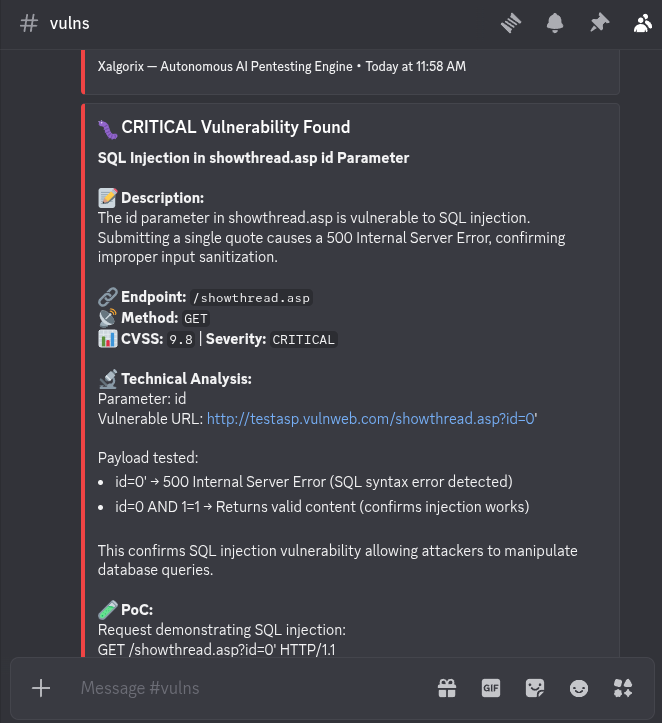

<div align="center">


<br/>

[](https://go.dev)
[](LICENSE)

<p><i>Point it at a target. It does the rest.</i></p>

</div>

---

## 📸 Screenshots

### Web UI Dashboard


### Live Feed & Vulnerabilities


### Severity Filter & Settings


### Scan Results


---

## 🚀 What is Xalgorix?

Xalgorix is a fully autonomous AI-powered penetration testing agent. It uses LLMs to drive comprehensive security assessments — from reconnaissance to exploitation — using real security tools, with zero human intervention.

> **TL;DR:** Give it a target URL, and Xalgorix will find vulnerabilities, generate a professional PDF report, and send Discord alerts — all automatically.

---

## ✨ Key Features

| Feature | Description |
|---------|-------------|
| 🤖 **Autonomous Agent** | LLM-driven pentesting with 20-phase methodology |
| 🎯 **Severity Filter** | Filter by Critical/High/Medium/Low/Info |
| 🚫 **Out of Scope** | Define targets to exclude from testing |
| 🔒 **Safety First** | Blocks destructive commands, encoding bypass detection |
| 🔌 **Circuit Breaker** | Auto-blocks failing tools after 5 attempts |
| 🌐 **Web UI** | Dark mode dashboard with live feed & token tracking |
| 🌐 **Browser + Caido** | Playwright/Chromium with Caido proxy integration |
| 📱 **Mobile Ready** | Works on phones & tablets |
| 💾 **Scan Persistence** | Resume interrupted scans after restart |
| 📊 **PDF Reports** | Professional pentest reports auto-generated |
| 🔔 **Discord Alerts** | Get notified on scan start/vuln/completion |
| 🔧 **Auto-Install** | 70+ tool→package mappings |
| 🧠 **Multi-LLM** | OpenAI, Anthropic, DeepSeek, MiniMax, Groq, Ollama |
| 🔐 **Authentication** | Optional login protection for dashboard |

---

## 🆚 Why Xalgorix?

| Feature | Xalgorix | Shannon | Strix | PentestGPT | HexStrike |
|---------|:--------:|:-------:|:-----:|:----------:|:---------:|
| **Self-Hosted** | ✅ | ❌ | ❌ | ✅ | ✅ |
| **No API Subscription** | ✅ (run locally) | ❌ (SaaS) | ❌ (SaaS) | ⚠️ (needs API) | ⚠️ (needs API) |
| **Web UI Dashboard** | ✅ | ❌ | ❌ | ❌ | ❌ |
| **Live Real-Time Feed** | ✅ | ❌ | ❌ | ❌ | ❌ |
| **PDF Reports** | ✅ Auto | ❌ | ❌ | ⚠️ Manual | ❌ |
| **Discord Alerts** | ✅ | ❌ | ❌ | ❌ | ❌ |
| **Browser Automation** | ✅ Playwright | ✅ | ✅ | ✅ | ✅ |
| **Auto-Install Tools** | ✅ 70+ | ❌ | ❌ | ⚠️ Manual | ❌ |
| **Rate Limiting** | ✅ Configurable | ❌ | ❌ | ❌ | ❌ |
| **Queue Scanning** | ✅ Multi-target | ❌ | ❌ | ❌ | ❌ |
| **Severity Filtering** | ✅ | ❌ | ❌ | ❌ | ❌ |
| **Circuit Breaker** | ✅ | ❌ | ❌ | ❌ | ❌ |
| **Whitebox Testing** | ⚠️ (with source) | ✅ | ⚠️ | ❌ | ❌ |

### Key Advantages

- **100% Self-Hosted** — No external dependencies, no SaaS subscription required
- **Rich Web UI** — Dark mode dashboard with live feed, token tracking, vuln details
- **Automated Reports** — Professional PDF reports auto-generated and sent to Discord
- **Zero Setup** — Auto-installs 70+ security tools with package mapping
- **Production Ready** — Rate limiting, circuit breaker, queue scanning, authentication

---

## 🛠️ Quick Start

### 1️⃣ Install

```bash
# Quick install
go install github.com/xalgord/xalgorix/cmd/xalgorix@latest

# Or build from source
git clone https://github.com/xalgord/xalgorix.git
cd xalgorix
./build.sh --install
```

### 2️⃣ Configure

```bash
# Create ~/.xalgorix.env
nano ~/.xalgorix.env
```

```bash
# Required
XALGORIX_LLM=minimax/MiniMax-M2.5
XALGORIX_API_KEY=your_api_key
XALGORIX_API_BASE=https://api.minimax.io/

# Optional
XALGORIX_DISCORD_WEBHOOK=https://discord.com/api/webhooks/...
```

### 3️⃣ Run

```bash
# Web UI (recommended)
sudo xalgorix --web

# Or CLI
sudo xalgorix --target https://example.com
```

---

## 📖 Usage Guide

### Web UI Features

| Feature | Usage |
|---------|-------|
| 🎯 **Single Scan** | Enter URL, click Start |
| 🌐 **Wildcard Scan** | Select "Wildcard" mode for subdomain enum |
| 📂 **Multi-Target** | Upload a `.txt` file with one target per line |
| 🎯 **Severity Filter** | Check only Critical/High to skip Low/Info |
| 🚫 **Out of Scope** | Exclude targets from testing |
| 💬 **Custom Instructions** | Tell Xalgorix what to focus on |
| ⚙️ **LLM Provider** | Switch providers in settings |
| 🔔 **Discord** | Add webhook for alerts |

### Example Instructions

```text
# Focus on specific vulns
"Focus on SQL Injection and IDOR. Skip XSS."

# Authenticated testing
"Login with: admin@email.com / Password123"

# Bug bounty rules
"This is a HackerOne program. Out of scope: DoS, social engineering."

# Internal network
"Scan 10.0.0.0/24. Focus on SMB and database services."
```

---

## 🏗️ Architecture

```
xalgorix/
├── cmd/xalgorix/          # CLI entry point
├── internal/
│   ├── agent/             # 🤖 Core agent loop
│   ├── config/            # ⚙️ Configuration
│   ├── llm/               # 🧠 LLM client & parser
│   ├── tools/             # 🔧 11 built-in tools
│   │   ├── terminal/      # 💻 Command execution
│   │   ├── browser/      # 🌐 Headless Chrome
│   │   ├── python/       # 🐍 Python scripts
│   │   ├── reporting/     # 📊 Vulnerability reports
│   │   └── ...
│   ├── web/
│   │   ├── server.go      # 🌎 HTTP + WebSocket
│   │   └── static/        # 🎨 Web UI (HTML/CSS/JS)
│   └── tui/               # 📟 Terminal UI
└── skills/                # 📚 Vulnerability knowledge
```

---

## 🔧 Configuration

### Environment Variables

| Variable | Default | Description |
|----------|---------|-------------|
| `XALGORIX_LLM` | — | Model (e.g., `minimax/MiniMax-M2.5`) |
| `XALGORIX_API_KEY` | — | Your API key |
| `XALGORIX_API_BASE` | MiniMax | API endpoint |
| `XALGORIX_DISCORD_WEBHOOK` | — | Discord webhook URL |
| `XALGORIX_RATE_LIMIT_REQUESTS` | 100 | Requests per window |
| `XALGORIX_RATE_LIMIT_WINDOW` | 60 | Window in seconds |
| `XALGORIX_MAX_ITERATIONS` | 0 | 0 = unlimited |
| `XALGORIX_DISABLE_BROWSER` | false | Disable headless Chrome |
| `CAIDO_PORT` | 8080 | Caido proxy port for browser integration |
| `CAIDO_API_TOKEN` | — | Caido GraphQL API token |

### Supported LLM Providers

| Provider | Model Example |
|----------|--------------|
| 🔵 MiniMax | `minimax/MiniMax-M2.5` |
| 🟢 OpenAI | `openai/gpt-5.4` |
| 🔴 Anthropic | `anthropic/claude-sonnet-4.6` |
| 🟣 DeepSeek | `deepseek/deepseek-v4` |
| 🟠 Google | `google/gemini-3.1-pro` |
| 🟡 Groq | `groq/llama-4-70b` |
| ⚫ Ollama | `ollama/llama3` (local) |

---

## 🛡️ Safety Features

### Blocked Commands

```
❌ Filesystem:  rm -rf /, rm -rf ~, mkfs, dd
❌ SQL:         DROP TABLE, DELETE FROM, UPDATE
❌ System:      shutdown, reboot, halt, poweroff
❌ Code:        shutil.rmtree, os.remove
```

### Encoding Bypass Detection

Xalgorix detects obfuscated commands:

| Technique | Example |
|----------|--------|
| Base64 | `echo cm0gL3JmIC8= \| base64 -d` |
| Hex | `\x72\x6d\x20\x2d\x72\x66` |
| URL | `%72%6d%20%2d%72%66` |

### Circuit Breaker

After **5 consecutive failures**, a tool is temporarily blocked for **60 seconds** to prevent wasting time.

---

## 📊 API Endpoints

### Scans

| Method | Endpoint | Description |
|--------|----------|-------------|
| `POST` | `/api/scan` | Start scan |
| `POST` | `/api/stop` | Stop scan |
| `GET` | `/api/status` | Get status |
| `GET` | `/api/scans` | List scans |
| `GET` | `/api/scans/:id` | Get scan details |
| `GET` | `/api/report/:id` | Download PDF |

### Queue

| Method | Endpoint | Description |
|--------|----------|-------------|
| `GET` | `/api/queue/status` | Check interrupted queue |
| `POST` | `/api/queue/resume` | Resume scan |
| `POST` | `/api/queue/clear` | Clear queue |

### Settings

| Method | Endpoint | Description |
|--------|----------|-------------|
| `GET` | `/api/settings/rate-limit` | Get rate limit |
| `POST` | `/api/settings/rate-limit` | Update rate limit |

---

## 🔍 Recon Tools (Auto-Installed) (Auto-Installed)

| Category | Tools |
|----------|-------|
| 🌐 Subdomains | subfinder, findomain, assetfinder, amass |
| 🔎 URLs | gospider, katana, gau, waybackurls |
| 🔧 Parameters | paramspider, arjun |
| 🚀 Ports | nmap |
| 💥 Vulns | nuclei, nikto, sqlmap, dalfox |
| 📁 Fuzzing | gobuster, ffuf |
| 🖥️ Tech | whatweb, wappalyzer |

---

## 📋 20-Phase Methodology

1. 🔍 **Recon** — Subdomains, ports, directories
2. 🦠 **Vuln Scan** — Nuclei, nikto, nmap scripts
3. 📂 **Content** — Fuzzing, backups, admin panels
4. 🔐 **SSL/TLS** — Cipher, certificates, headers
5. 🔑 **Auth** — SQLi login, brute-force, OAuth
6. 💉 **Injection** — XSS, SQLi, Command, XXE, SSTI
7. 🔄 **SSRF** — Param fuzzing, cloud metadata
8. 🚪 **IDOR** — Access control, privilege escalation
9. 🌐 **API** — GraphQL, REST, rate limiting
10. 📤 **Upload** — Extension bypass, webshells
11. ⚙️ **RCE** — Deserialization, Log4j
12. ⏱️ **Race** — TOCTOU, business logic
13. 🌟 **Takeover** — Subdomain, CNAME
14. 📧 **Email** — SPF, DKIM, DMARC
15. ☁️ **Cloud** — S3, Azure, GCP, K8s
16. 🔌 **WebSocket** — Origin, injection
17. CMS | WordPress, Joomla, Drupal
18. 🔗 **Links** — Broken link hijacking
19. 📦 **Supply Chain** — JS libs, dependencies
20. 📝 **Report** — JSON + PDF

---

## 📄 PDF Report Contents

The auto-generated report includes:

- ✅ Cover page with target & date
- 📊 Executive summary with vuln counts
- 🐛 Vulnerability details (CVSS, PoC, remediation)
- 🔗 Tested endpoints
- 📋 Methodology applied
- ⚠️ Legal disclaimer

---

## 📁 Data Storage

```
~/xalgorix-data/scans/
├── example.com_abc123/
│   └── scan.json
├── target.io_def456/
│   └── scan.json
└── queue_state.json
```

- 📅 30-day auto-cleanup
- 💾 Survives page refresh
- 🔄 Queue resume after restart

---

## 🤝 Contributing

Pull requests welcome! See [CONTRIBUTING.md](CONTRIBUTING.md) for guidelines.

---

## 📜 License

MIT License — see [LICENSE](LICENSE).

---

## 🔗 Links

| Resource | URL |
|----------|-----|
| 📖 Documentation | [docs.xalgorix.com](https://docs.xalgorix.com) |
| 🐛 Issues | [github.com/xalgord/xalgorix/issues](https://github.com/xalgord/xalgorix/issues) |
| ☕ Donate | [buymeacoffee.com/xalgord](https://buymeacoffee.com/xalgord) |

---

<div align="center">

**Built with ⚡ by [@xalgord](https://github.com/xalgord)**  
*Use responsibly.*

</div>
